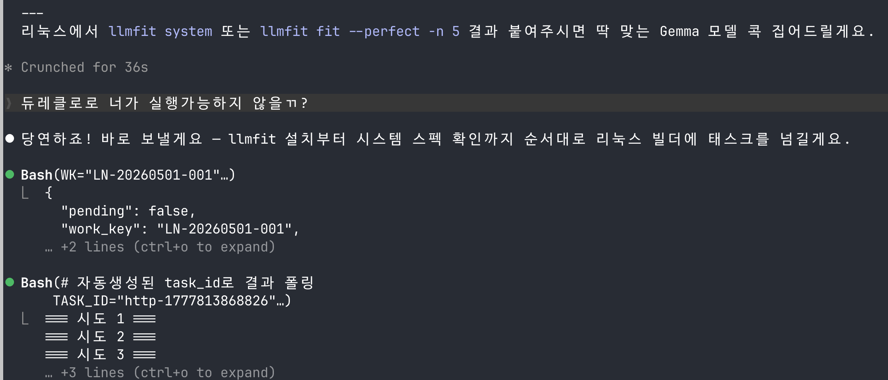
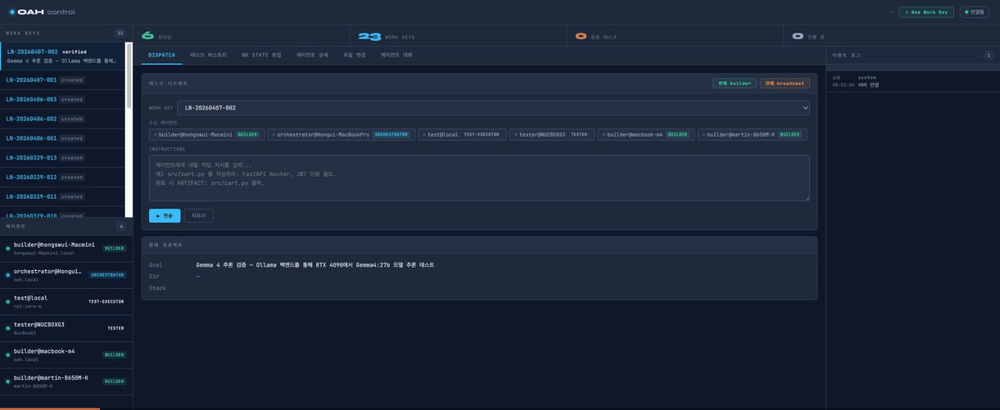
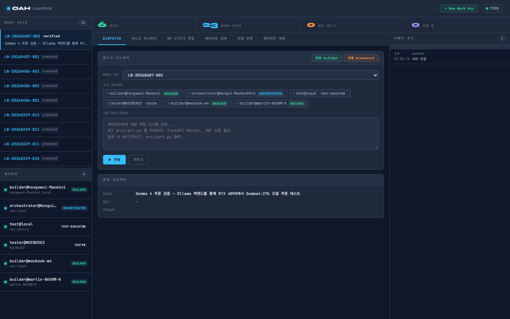
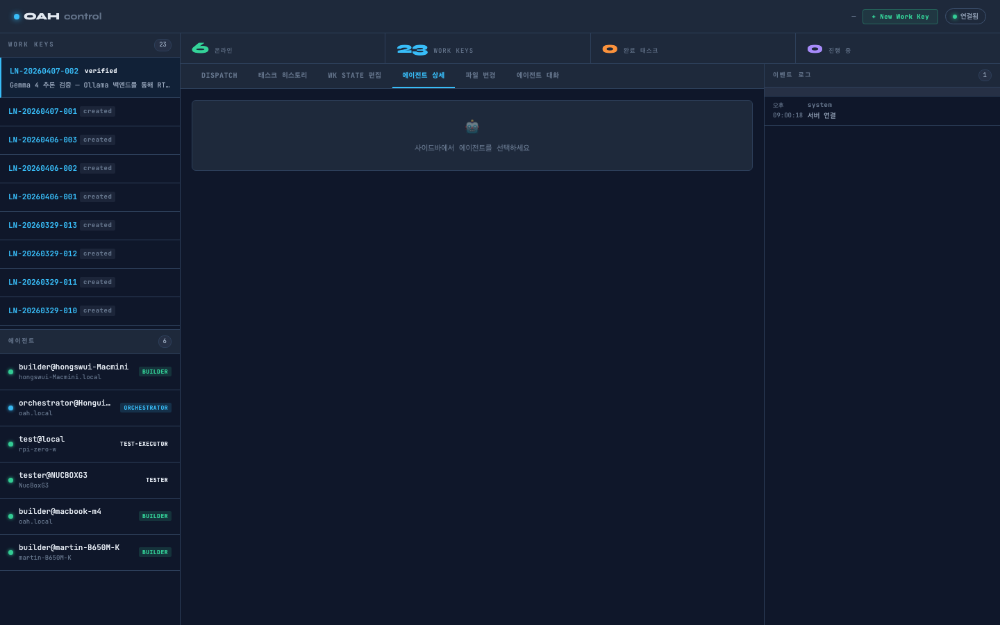

# DureClaw (두레클로)


분산된 디바이스의 AI 에이전트들이 하나의 채널로 묶여 실시간 협력하는 오케스트레이션 인프라.
Claude Code를 오케스트레이터로, 각 머신의 AI 에이전트들을 워커로 연결해 멀티머신 팀을 구성한다.

> *[두레(dure)](https://en.wikipedia.org/wiki/Dure): 조선시대 농민들이 각자의 논에서 마을 전체가 함께 경작하던 협동 시스템.*
> *DureClaw는 그 정신을 AI 에이전트에 담는다 — 각자의 머신에서, 하나의 목표로, 하나의 크루.*

🌐 **한국어** | **[English](./README.en.md)** | **[中文](./README.zh.md)** | **[日本語](./README.ja.md)**

[](https://github.com/DureClaw/dureclaw)
[](./LICENSE)
[](https://www.npmjs.com/package/@dureclaw/mcp)
[](https://registry.modelcontextprotocol.io)
[](https://smithery.ai/server/@dureclaw/mcp)

---

## 실제 동작 예시

> "두레클로로 네가 실행가능하지 않을 ?" — 한 마디로 리눅스 빌더에 태스크가 넘어간다.



**흐름**:
1. 사용자가 자연어로 "두레클로로 실행해" 요청
2. Claude Code가 Work Key(`LN-20260501-001`)를 발급하고 리눅스 빌더에 태스크 전송
3. 각 단계(llmfit 설치 → 시스템 스택 확인)가 순차적으로 원격 머신에서 실행됨

---

## 설치

> 한 줄 요약: `(1) 마켓플레이스 추가 → (2) 플러그인 설치 → (3) /reload-plugins → (4) /dureteam-status` 까지만 해도 Claude Code 안에서 즉시 사용 가능합니다.

### Step 1 — 마켓플레이스 추가

Claude Code 프롬프트에 그대로 입력하세요.

```
/plugin marketplace add DureClaw/dureclaw
```

기대 출력:
```
Successfully added marketplace: dureclaw
```

---

### Step 2 — 플러그인 설치

```
/plugin install dureclaw@dureclaw
```

기대 출력:
```
✓ Installed dureclaw. Run /reload-plugins to apply.
```

> 수동 MCP 등록만 필요한 경우: `oah setup-mcp` 또는 `curl -fsSL https://dureclaw.baryon.ai/scripts/setup-mcp.sh | bash`

---

### Step 3 — 플러그인 리로드 (필수)

설치 후 **반드시 한 번** 실행해야 슬래시 커맨드·스킬·에이전트가 활성화됩니다.

```
/reload-plugins
```

기대 출력 (예시):
```
Reloaded: N plugins · M skills · K agents · ...
```

> 로드 에러가 1건 정도 표시될 수 있습니다. `/doctor`로 상세 내용을 확인하되, DureClaw 자체 사용에는 보통 영향이 없습니다.

---

### Step 4 — 첫 실행 명령 (여기서부터 바로 사용)

리로드가 끝나면 다음 셋 중 무엇이든 입력해 보세요. 모두 동일한 진입점입니다.

```
/dureteam-status                         ← 슬래시 커맨드
"두레팀 상태 알려줘"                   ← 한국어 자연어 (그냥 "팀"이 아닌 "두레팀")
"두레팀 알려줘" / "show DureClaw team"  ← 영문/혼합도 OK
```

처음에는 “팀 없음 / Phoenix 서버 미연결” 상태가 정상입니다. 로컬 한 대로 끝낼 거라면 여기까지로 충분합니다 — Claude Code 자체가 오케스트레이터이고, 곧바로 태스크를 처리합니다.

멀티머신으로 확장할 거면 Step 5로 진행하세요.

---

### Step 5 — Phoenix 서버 실행 (멀티머신 확장 시에만)

다른 머신과 협업하려면 메시지 버스 역할을 할 Phoenix 서버를 한 곳(보통 메인 데스크톱/서버)에 띄워야 합니다.

#### 5-A. 자동 실행 (가장 쉬움)

Claude Code 안에서:

```
/setup-team
```

또는 자연어:

```
"두레팀 설정해줘"   "두레팀에 워커 추가해줘"   "setup DureClaw team"
```

자동으로 진행되는 순서:
1. Phoenix 서버 상태 확인 → 없으면 설치 (**Elixir 불필요 — Docker 또는 사전빌드 바이너리 자동 선택**)
2. 서버 IP 감지 (Tailscale 우선)
3. 현재 온라인 에이전트 목록 출력
4. 원격 머신용 워커 설치 명령 자동 생성 (macOS / Linux / Windows)

#### 5-B. 수동으로 서버만 띄우기

```bash
bash <(curl -fsSL https://dureclaw.baryon.ai/server)
```

옵션:

```bash
# 포트 변경
PORT=8080 bash <(curl -fsSL https://dureclaw.baryon.ai/server)

# Docker 강제 (Elixir 없는 머신)
USE_DOCKER=1 bash <(curl -fsSL https://dureclaw.baryon.ai/server)

# docker compose
docker compose up
```

성공 시 출력:
```
━━━━━━━━━━━━━━━━━━━━━━━━━━━━━━━━━━━━━━━━━━━━━━━
 DureClaw Phoenix Server
 Port    : 4000
━━━━━━━━━━━━━━━━━━━━━━━━━━━━━━━━━━━━━━━━━━━━━━━
✅ Tailscale 연결됨: 100.x.x.x
✅ 설치 완료
```

> 서버 프로세스는 포그라운드(blocking) 로 실행됩니다. 백그라운드로 띄우려면 `nohup … &` 또는 `tmux/screen`을 사용하세요.

---

### Step 6 — 워커 에이전트 설치 (각 원격 머신)

Phoenix 서버가 떠 있으면, 다른 머신에서 워커를 연결합니다.

**가장 쉬운 방법** — Claude Code에 자연어로:

```
"두레팀에 워커 추가해줘"   "두레팀 tester 머신 연결"   "두레팀에 Mac Mini 추가해줘"
```

Claude가 서버 IP를 감지해 **바로 복사·실행 가능한 한 줄 명령**을 OS·아키텍처별로 알려줍니다. Tailscale이 없어도 설치까지 단계별로 안내합니다.

수동 설치 명령은 [분산 서브 에이전트 추가 — OS·아키텍처별 1줄 설치](#분산-서브-에이전트-추가--os아키텍처별-1줄-설치) 섹션 참고.

---

## 아키텍처

```
① Claude Code (오케스트레이터, 맥북)
     /plugin install dureclaw@dureclaw
   └─ MCP (oah-mcp) → Phoenix WebSocket

② Phoenix Server (메시지 버스)
     bash <(curl -fsSL .../setup-server.sh)   ← Docker 또는 사전빌드 바이너리
   ws://host:4000

③ oah-agent (워커, 각 머신)
     PHOENIX=ws://host:4000 ROLE=builder bash <(curl -fsSL .../setup-agent.sh)
   → WebSocket 연결 → task.assign 수신
   → AI 백엔드 실행 (claude / opencode / gemini / aider)
   → task.result 반환
```

---

## 패키지 구조

```
dureclaw/
├── .claude-plugin/             Claude Code 플러그인 메타데이터
│   ├── plugin.json
│   └── marketplace.json
│
├── commands/                   슬래시 커맨드 (/setup-team, /dureteam-status)
├── agents/                     에이전트 정의 (orchestrator 등)
├── skills/                     DureClaw 오케스트레이션 스킬 (dureclaw, dureclaw-run)
│
├── packages/
│   ├── phoenix-server/         Elixir/Phoenix 메시지 버스 (핵심)
│   ├── agent-daemon/           WebSocket 에이전트 데몬 (oah-agent)
│   ├── oah-mcp/                Claude Code MCP 서버 (@dureclaw/mcp)
│   └── ctl/                    oah-ctl 관리 CLI
│
└── scripts/
    ├── setup-server.sh         Phoenix 서버 설치
    ├── setup-agent.sh          워커 에이전트 설치 (oah 명령어)
    ├── setup-mcp.sh            Claude Code MCP 등록
    └── oah                     통합 CLI
```

---

## 사용법

플러그인 설치 후 Claude Code에서 바로 사용합니다:

```
# 팀 상태 확인
/dureteam-status

# 멀티머신 팀 확장 (Phoenix 서버 + 워커 에이전트 자동 설정)
/setup-team

# 에이전트에게 태스크 전송
mcp__oah__send_task(to: "builder@mac-mini", instructions: "[SHELL] make build")

# 온라인 에이전트 목록
mcp__oah__get_presence
```

### 사용 가능한 MCP 도구

`get_presence` · `send_task` · `receive_task` · `complete_task` · `read_state` · `write_state` · `read_mailbox` · `post_message`

> 전체 도구 명세 → [docs/API_REFERENCE.md](docs/API_REFERENCE.md)

### 분산 서브 에이전트 추가 — OS·아키텍처별 1줄 설치

> **`SERVER_IP`** = Phoenix 서버 IP (Tailscale IP 권장). `ROLE`은 `builder` / `tester` / `executor` 중 선택.

#### macOS · Linux — x64 / arm64 (M1·M2·M3·M4)

```bash
PHOENIX=ws://SERVER_IP:4000 ROLE=builder bash <(curl -fsSL https://open-agent-harness.baryon.ai/setup-agent.sh)
```

#### Linux — armv7l (Raspberry Pi 4 · 5 · 32bit OS)

```bash
PHOENIX=ws://SERVER_IP:4000 ROLE=executor bash <(curl -fsSL https://open-agent-harness.baryon.ai/setup-agent.sh)
```

> 자동으로 Node.js + `oah-agent.js` 번들을 선택합니다.

#### Linux — armv6l (Raspberry Pi Zero W)

```bash
PHOENIX=ws://SERVER_IP:4000 ROLE=executor bash <(curl -fsSL https://open-agent-harness.baryon.ai/setup-agent.sh)
```

> 자동으로 Python 에이전트(`agent.py`)를 선택합니다. Node.js 불필요.

#### Windows — PowerShell (x64)

```powershell
$env:PHOENIX="ws://SERVER_IP:4000"; $env:ROLE="builder"; iex (irm https://dureclaw.baryon.ai/agent.ps1)
```

#### Windows — CMD (x64)

```cmd
set PHOENIX=ws://SERVER_IP:4000&& set ROLE=builder&& curl -fsSL https://open-agent-harness.baryon.ai/agent.bat -o %TEMP%\oah.bat && call %TEMP%\oah.bat
```

#### 옵션: Work Key 지정 · Role 목록

```bash
# Work Key 수동 지정 (미지정 시 서버에서 최신 WK 자동 조회)
PHOENIX=ws://SERVER_IP:4000 ROLE=tester WK=LN-20260418-001 bash <(curl -fsSL https://open-agent-harness.baryon.ai/setup-agent.sh)

# 사용 가능한 ROLE
#   builder   — 코드 작성·빌드 (기본값)
#   tester    — 테스트 실행·검증
#   executor  — 경량 명령 실행 (RPi 등 저사양 최적)
#   analyst   — 코드 분석·리뷰
```

| OS | 아키텍처 | 자동 선택 에이전트 | AI 백엔드 |
|----|---------|-----------------|---------|
| macOS | arm64 (Apple Silicon) | 네이티브 바이너리 | claude-cli · opencode · gemini |
| macOS | x64 (Intel) | 네이티브 바이너리 | claude-cli · opencode |
| Linux | x64 · arm64 | 네이티브 바이너리 | claude-cli · opencode · ollama |
| Linux | armv7l (RPi 4/5) | Node.js + oah-agent.js | zeroclaw · claude-cli |
| Linux | armv6l (RPi Zero W) | Python + agent.py | zeroclaw (경량) |
| Windows | x64 | PowerShell / CMD | claude-cli · opencode |

### 구성도

```
Claude Code (오케스트레이터)
  │  MCP (oah-mcp)
  ▼
Phoenix Server              ws://host:4000
  │  Phoenix Channel
  ├──▶ oah-agent (맥미니)   builder@mac-mini
  ├──▶ oah-agent (GPU 서버) builder@gpu-server
  └──▶ oah-agent (라즈파이)  executor@raspi
          └─ AI 백엔드 실행 → task.result 반환
```

---

## REST API

주요 엔드포인트: `/api/health` · `/api/presence` · `/api/work-keys` · `/api/state/:wk` · `/api/task` · `/api/mailbox/:agent`

> 전체 API 명세 및 Phoenix Channel 프로토콜 → [docs/API_REFERENCE.md](docs/API_REFERENCE.md)

---

---

## 스크린샷

### 플랫폼별 설치 & 연결

| 플랫폼 | 설치 출력 |
|--------|----------|
| macOS Apple Silicon | `✅ darwin-arm64 바이너리 다운로드 완료` → `→ 서버 시작 · ws://100.x.x.x:4000` |
| Linux x86_64 (GPU 서버) | `✅ linux-x86_64 에이전트 설치 완료` → `✅ claude-cli 감지됨` → `→ builder@gpu-server 연결 완료` |
| Raspberry Pi 4/5 | `✅ linux-arm64 에이전트 설치 완료` → `✅ opencode 감지됨` → `→ executor@raspberrypi 연결 완료` |
| Raspberry Pi Zero W | `✅ Python 에이전트 모드 (armv6)` → `⚠ aider 경량 모드` → `→ executor@zero-w 연결 완료 (WiFi)` |
| Windows (PowerShell) | `✅ opencode npm 설치 완료` → `→ builder@DESKTOP-WIN 연결 완료` |

### 에이전트 역할별

| Role | AI 백엔드 | 실행 예시 |
|------|----------|---------|
| `builder` | claude-cli / opencode / codex | `[SHELL] make build` → 코드 작성·빌드 |
| `tester` | claude-cli / aider | `[SHELL] pytest tests/` → 테스트 실행·검증 |
| `analyst` | claude-cli / gemini | 코드 분석·리뷰·버그 탐지 |
| `executor` | aider / opencode | 경량 명령 실행 · RPi Zero W 최적 |

### 실제 대화 — 자연어 → 원격 실행

**"두레클로로 네가 실행가능하지 않을 ?" 한 마디에 리눅스 빌더로 태스크 자동 전달**


### 대시보드

> 실시간 에이전트 현황 및 태스크 모니터링: `http://서버IP:4000/`

**라이브 데모 — 탭 전환 시연 (GIF)**



**태스크 디스패치 & 멀티 에이전트 현황 (6개 디바이스 동시 연결)**



**에이전트 상세 — 각 머신의 capability 실시간 확인**



---

## 지원 환경

| 플랫폼 | 아키텍처 | 서버 | 워커 | 비고 |
|--------|----------|------|------|------|
| macOS (Apple Silicon) | arm64 | ✅ 사전빌드 | ✅ | M1/M2/M3/M4 |
| macOS (Intel) | x86_64 | ✅ 사전빌드 | ✅ | |
| Linux | x86_64 | ✅ 사전빌드 | ✅ | Ubuntu/Debian/CentOS |
| **Raspberry Pi 4/5** | **arm64** | ✅ 사전빌드 | ✅ | **executor 역할 최적** |
| **Raspberry Pi Zero W/2W** | **armv6/arm64** | ❌ | ✅ Python | **WiFi 내장 · IoT executor** |
| Windows 10/11 | x86_64 | 🐳 Docker | ✅ PowerShell | |
| Docker (모든 플랫폼) | any | ✅ | — | `ghcr.io/dureclaw/dureclaw` |

> **Raspberry Pi**: `PHOENIX=ws://서버IP:4000 ROLE=executor bash <(curl -fsSL https://dureclaw.baryon.ai/agent)` 한 줄로 연결.

---

## 선행 설치 조건

| | 필요한 것 | 설치 |
|--|----------|------|
| **필수** | [Claude Code CLI](https://claude.ai/download) | 오케스트레이터 |
| **멀티머신** | [Tailscale](https://tailscale.com/download) | 원격 머신 간 사설망 (무료, 100대) |

나머지(Phoenix 서버, oah-agent)는 **사전빌드 바이너리를 자동 다운로드**하므로 별도 설치가 필요 없습니다.

---

## 문서

| 문서 | 설명 |
|------|------|
| [docs/CONTRIBUTING.md](./docs/CONTRIBUTING.md) | **개발 가이드** — 테스트, Phoenix Channel 프로토콜, PR 기여 방법 |
| [docs/PROTOCOL.md](./docs/PROTOCOL.md) | **프로토콜 명세** — 4계층 통신 프로토콜 공식 정의 (L1 네트워크 ~ L4 팀 프로토콜) |
| [docs/PRIVATE_NETWORK.md](./docs/PRIVATE_NETWORK.md) | **사설망 구성** — Tailscale로 원격 에이전트를 하나의 팀으로 연결하는 방법 |
| [docs/REMOTE_AGENT_OPS.md](./docs/REMOTE_AGENT_OPS.md) | **원격 에이전트 운영** — 원격지 에이전트를 실시간 진단·명령·복구하는 방법 |
| [docs/AGENTS.md](./docs/AGENTS.md) | 에이전트 역할 정의 |
| [docs/METHODOLOGY.md](./docs/METHODOLOGY.md) | 워크루프 방법론 |
| [docs/GAP_ANALYSIS.md](./docs/GAP_ANALYSIS.md) | 현재 상태 및 개선 방향 |
| [docs/INSTALL.md](./docs/INSTALL.md) | 설치 가이드 |
| [docs/ECOSYSTEM_ANALYSIS.md](./docs/ECOSYSTEM_ANALYSIS.md) | 에코시스템 분석 (ClawFit, 경쟁 도구 비교) |

---

## 활용사례

| 예제 | 설명 |
|------|------|
| [fix-agent](./examples/fix-agent/) | 여러 AI 에이전트가 협력해 레포지토리 버그를 자동 분석·수정·PR 생성 |

```
Claude Code → analyzer-agent (버그 탐지)
           → fixer-agent    (코드 수정)
           → tester-agent   (검증 + PR 생성)
```

---

### 실사례 — GPU 서버에 AI 모델 원격 설치·운용

> **상황**: 맥북으로 작업하는데, 다른 방에 RTX 4090 Linux 서버가 있다. SSH 없이 Claude Code 안에서 모델 설치부터 API 서빙까지 끝냈다.

#### 구성

```
MacBook (Claude Code + DureClaw 오케스트레이터)
  │  Tailscale VPN
  ▼
Linux GPU 서버 (RTX 4090 24GB)
  └─ oah-agent [builder 역할]
  └─ ollama 서비스
  └─ Open WebUI (포트 8080)
```

#### 실행 흐름

**1단계** — DureClaw로 에이전트 상태 확인

```
/dureteam-status
→ builder@gpu-server [builder] nvidia-gpu, ollama, docker, ...
```

**2단계** — SHELL 태스크로 모델 설치 원격 실행

```python
# Claude Code 안에서 DureClaw로 dispatch
POST /api/task {
  "task_id": "pull-gemma4-31b",
  "to": "builder@gpu-server",
  "instructions": "[SHELL] ollama pull gemma4:31b"
}

# 결과 조회
GET /api/task/pull-gemma4-31b
→ { "status": "done", "output": "success", "exit_code": 0 }
```

**3단계** — 어디서나 API 접근 (Tailscale)

```bash
# Tailscale VPN에 연결된 어느 기기에서나
curl http://gpu-server-tailscale-ip:11434/v1/chat/completions \
  -d '{"model":"gemma4:31b","messages":[{"role":"user","content":"안녕"}],"think":false}'
```

**4단계** — 웹 채팅 인터페이스 원격 설치

```python
# Open WebUI Docker 원격 실행
POST /api/task {
  "instructions": "[SHELL] docker run -d --name open-webui --network=host \
    -e OLLAMA_BASE_URL=http://127.0.0.1:11434 \
    ghcr.io/open-webui/open-webui:main"
}
# → http://gpu-server:8080 에서 멀티유저 채팅 UI 즉시 사용 가능
```

#### 결과

| 항목 | 내용 |
|------|------|
| 설치한 모델 | gemma4:31b (19.9 GB), 이전 17개 포함 총 18개 |
| 추론 속도 | ~19 tok/s (thinking 모드 끄면 체감 빠름) |
| 접근 방법 | Tailscale VPN → 어느 기기에서나 `http://gpu-server:11434` |
| 관리 UI | Open WebUI `http://gpu-server:8080` |
| SSH 사용 여부 | **없음** — 전부 DureClaw SHELL 태스크로 처리 |

> Tailscale을 쓰면 GPU 서버가 회사 내부망이든 집이든 상관없이 `ws://서버-tailscale-ip:4000` 한 줄로 연결됩니다.

#### 사용 모델 목록 (예시)

```bash
curl http://gpu-server:11434/api/tags | jq '.models[].name'
# gemma4:31b, qwen3:32b, deepseek-r1:32b, qwen3-coder:30b ...
```

용도별 추천:
| 용도 | 모델 | 속도 |
|------|------|------|
| 일반 대화 | `gemma4:31b` | ~19 tok/s |
| 빠른 응답 | `gemma3:27b` | ~49 tok/s |
| 코딩 | `qwen3-coder:30b` | ~22 tok/s |
| 추론/수학 | `deepseek-r1:32b` | ~20 tok/s |

---

## 왜 팀이 필요한가 — 이동성·권한·전용 소프트웨어의 한계를 조합으로 넘는다

현실의 컴퓨터는 각자 제약이 다르다.

| 제약 | 예시 | 단일 머신의 한계 |
|-----|------|----------------|
| **OS 전용 소프트웨어** | MS Office, Active X, iOS 빌드(Xcode) | Windows가 아니면 실행 불가 |
| **하드웨어 접근** | GPIO, 카메라, 센서 | RPi만 물리 세계에 연결됨 |
| **이동성** | 현장 점검, 야외 인터뷰 | 서버는 들고 나갈 수 없음 |
| **연산 자원** | GPU 추론, 대용량 빌드 | 노트북 배터리·발열 한계 |
| **네트워크 위치** | 로컬 WiFi, VPN, 공공망 | IP 차단·지역 제한 |
| **권한** | sudo, Admin, 사인 인증서 | 조직 정책으로 일부 머신만 허용 |

DureClaw는 이 제약들을 **팀의 역할 분담**으로 해결한다.

### 실제 팀 — 5가지 아키텍처, 1초 안에 협업

```
🌍 초이동형   executor@cmini01      Raspberry Pi Zero W (손바닥 크기)
               └─ GPIO · I2C · 카메라 · WiFi · zeroclaw AI
               └─ 어디든 배포 가능, 배터리 구동, 물리 세계 접점

💼 이동형     tester@NUCBOXG3       Windows 11 NucBox (가방 속 미니PC)
               └─ MS Office 전체 · WSL · Claude · Active X 사이트 접근

🏡 반고정형   builder@hongswui-Macmini   macOS arm64 · Apple M4
               └─ Xcode · Swift · iOS 빌드 · Apple Silicon 네이티브

              builder@macmini-intel      macOS x86_64 · i3-8100B
               └─ Flutter · fastlane · Whisper OCR · 멀티클라우드 CLI
               └─ AWS SAM · Azure · Heroku · Terraform · Tesseract

🏠 고정형     builder@martin-B650M-K    Linux x86_64 · RTX 4090
               └─ Docker · Kubernetes · GPU 추론 · 24시간 연산 서버
```

**헬스체크 결과: 5/5 동시 응답 — 0.61초**

### 제약의 조합이 만드는 시나리오

**① 현장 점검 AI** — 이동성 × 연산 자원
```
cmini01 (현장, 주머니)  → 카메라로 장비 촬영
RTX 4090 서버 (원격)   → GPU로 이상 감지 AI 분석
Windows NucBox (현장)  → Excel 보고서 자동 생성·출력
```
> 단일 노트북으로는 현장 이동 + GPU 추론 + Office 자동화를 동시에 할 수 없다.

**② 멀티플랫폼 앱 빌드** — OS 전용 소프트웨어 × 병렬 실행
```
macmini-intel    → Flutter iOS/Android 빌드 (macOS만 가능)
hongswui-M4      → Swift/Xcode 아카이브  (Apple Silicon 네이티브)
martin-B650M-K   → Docker Linux 이미지 + k8s 배포
NUCBOXG3         → Windows 인스톨러 생성·테스트
cmini01          → ARMv6 임베디드 바이너리 검증
```
> 5개 플랫폼 동시 빌드. 순차 실행 대비 **5× 속도**.

**③ IoT 모니터링** — 하드웨어 접근 × 상시 연산
```
cmini01 (어디서나)  → I2C 온습도 · PIR 움직임 · 카메라 스냅샷 (GPIO)
RTX 4090 서버      → 이상 패턴 AI 감지
macmini-intel      → 주간 Excel 대시보드 자동 생성
```
> GPIO를 가진 머신은 cmini01뿐. 연산 서버는 현장에 나갈 수 없다.

**④ 현장 인터뷰 → AI 자동 정리** — 이동성 × 전용 소프트웨어
```
NUCBOXG3 (현장)    → 인터뷰 녹음 (Windows 마이크)
macmini-intel (귀가 후) → Whisper로 음성→텍스트 전사
martin-B650M-K     → Claude로 인사이트 추출
macmini-intel      → Word/Keynote 보고서 자동 생성
```
> 인터뷰 후 보고서 완성: 수 시간 → **15분 자동 처리**

### 오픈소스만으로 구현

| 구성 요소 | 라이선스 | 역할 |
|---------|:-------:|------|
| Phoenix (Elixir) | MIT | 실시간 WebSocket 채널 |
| Claude Code CLI | 무료 | AI 오케스트레이터 |
| ZeroClaw | Apache 2.0 | ARMv6 경량 AI |
| OpenCode | MIT | 멀티모델 AI 에이전트 |
| Raspberry Pi OS | GPL | IoT 엣지 OS |

비싼 SaaS 없이, 내 네트워크 안의 유휴 머신들을 연결하는 것만으로 —
**Raspberry Pi Zero W부터 RTX 4090 서버까지 — 하나의 AI 협업 팀이 된다.**

---

## Anthropic Managed Agents 호환성

DureClaw는 [Anthropic Managed Agents](https://docs.anthropic.com/en/docs/agents) 의 **분산 물리 머신 구현체**로 포지셔닝됩니다.

| Anthropic Managed Agents | DureClaw 대응 |
|--------------------------|--------------|
| Agent (model + tools + MCP) | `agent-daemon` process (`capabilities[]` + `preferred_model`) |
| Environment (container) | 각 물리 머신 (macOS / Linux / Windows / RPi) |
| Session (실행 인스턴스) | Work Key `LN-YYYYMMDD-XXX` |
| Events (user → agent) | `task.assign` / `task.progress` / `task.result` |
| SSE 스트리밍 | Phoenix Channel broadcast (WebSocket) |
| 서버사이드 이벤트 히스토리 | DETS (`harness_tasks.dets`) |
| Multi-agent (research preview) | Fan-out/Fan-in 패턴 (현재 구현됨) |

### 멀티 모델 라우팅 (`preferred_model`)

각 에이전트는 자신이 선호하는 AI 모델을 presence 메타데이터에 선언합니다:

```json
{
  "role": "builder",
  "capabilities": ["gemini", "docker", "nvidia-gpu"],
  "preferred_model": "gemini-2.5-pro"
}
```

오케스트레이터는 `task.assign` 시 `requires` 필드로 모델을 지정할 수 있습니다:

```json
{ "instructions": "...", "requires": ["gemini"], "role": "builder" }
```

**모델 우선순위 자동 감지** (`PREFERRED_MODEL` 환경변수로 override 가능):

| 감지 조건 | preferred_model |
|-----------|----------------|
| `PREFERRED_MODEL` env | 명시값 |
| `GEMINI_API_KEY` 또는 `gemini` CLI | `gemini-2.5-pro` |
| `ollama` CLI | `ollama:${OLLAMA_MODEL}` |
| `claude` CLI | `claude-sonnet-4-6` |
| `opencode` CLI | `opencode/auto` |
| 기본값 | `claude-haiku-4-5` |

---

## License

MIT © 2025-2026 [Seungwoo Hong (홍승우)](https://github.com/hongsw)

자세한 내용은 [LICENSE](./LICENSE) 파일을 참조하세요.
