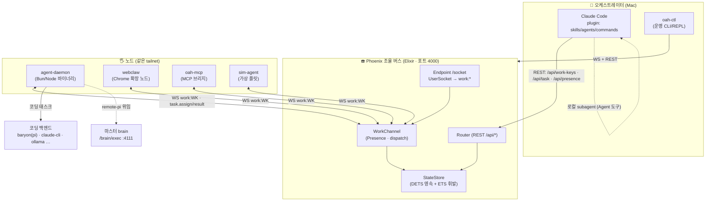
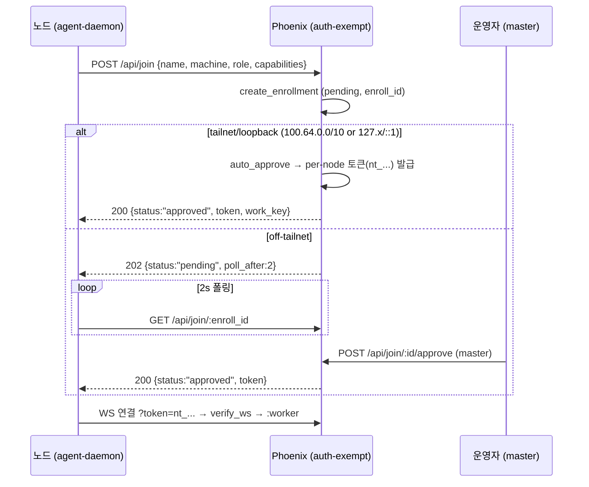
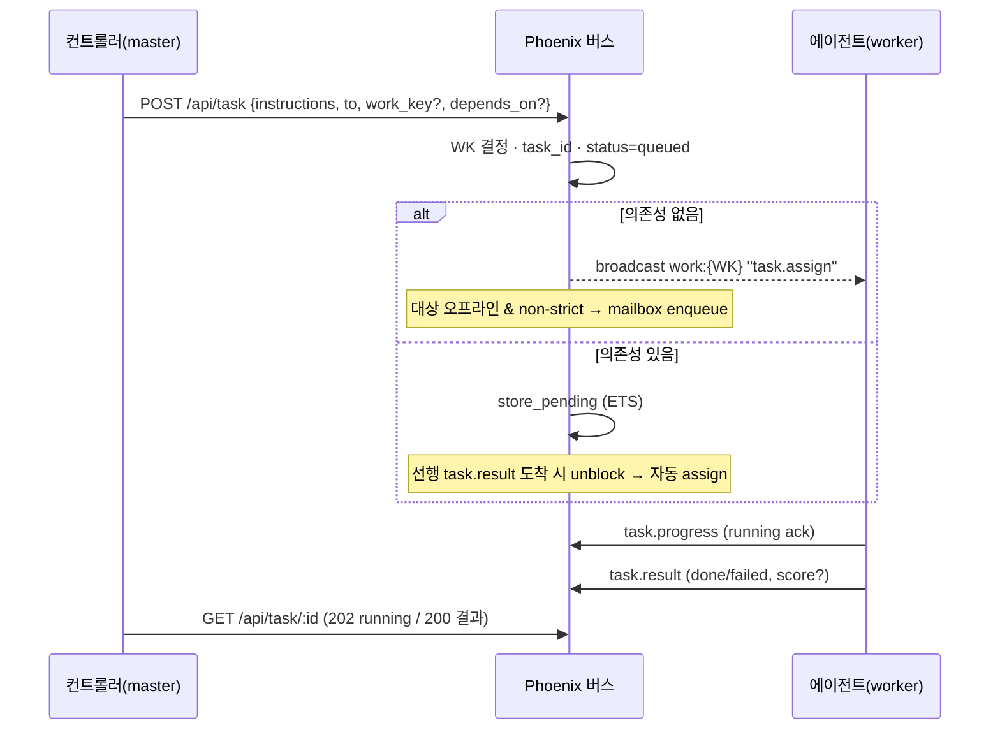
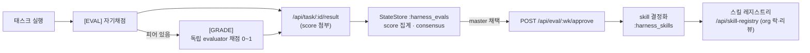

# DureClaw — 아키텍처 (내부 엔지니어링 문서)

> **대상 독자**: DureClaw 코어에 기여하거나 운영하는 개발자.
> **범위**: 전체 시스템의 구성요소·데이터모델·통신 프로토콜·핵심 흐름·배포.
> **최종 검증**: 2026-07-06 (코드 대조: `packages/phoenix-server/lib`, `packages/agent-daemon/src`, `scripts/`, `.github/workflows/`).
>
> 이 문서는 **정본(canonical) 아키텍처 레퍼런스**다. 마케팅/실측 리포트는 `docs/REPORT_*.md`, 통신 규약 상세는 `docs/PROTOCOL.md`를 참조. 문서 간 관계는 [§12 문서 맵](#12-문서-맵)에.

---

## 0. 정본 명칭 · 한 줄 정의

- **정본 제품명**: **DureClaw**. 내부 코드네임/OTP 앱은 **`open-agent-harness` (oah)** — 바이너리(`oah-agent`), CLI(`oah`), 환경변수(`OAH_*`), Elixir 모듈(`HarnessServer`)에 남아 있다. 둘은 같은 것을 가리킨다.
- **한 줄 정의**: Claude Code(오케스트레이터 두뇌) + Phoenix(Elixir) WebSocket 협력 버스. Mac이 조율하는 동안 GPU 서버·Linux·Windows·라즈베리파이·브라우저가 **같은 사설망(Tailscale) 위 하나의 버스**에 붙어 동시에 일한다.

> ⚠️ **네이밍 표류(알려진 이슈)**: 구 도메인 `open-agent-harness.baryon.ai` 잔재가 일부 옛 문서에 있으나, **현재 정본 도메인은 `dureclaw.baryon.ai`**. [§11](#11-버전--네이밍-정합성-알려진-불일치) 참조.

---

## 1. 시스템 한눈에



**세 개의 계층**:

| 계층 | 실체 | 책임 |
|---|---|---|
| **두뇌** | Claude Code 플러그인 + `oah-ctl` | 목표 분해·팀 설계·태스크 디스패치. 실제 실행은 버스로 위임 |
| **버스** | Phoenix `HarnessServer` (Elixir) | 노드 수명주기·태스크 라우팅·상태 영속·평가루프·스킬 레지스트리 |
| **손** | `agent-daemon` 및 동류 노드 | 태스크 수신 후 로컬 실행(코딩/셸/파일/스크린샷/브라우저) |

---

## 2. 구성요소

### 2.1 Phoenix 조율 버스 (`packages/phoenix-server`)

OTP 앱 `HarnessServer`. 감독 트리 부팅 순서 (`application.ex:29-35`, `:one_for_one`):

```
StateStore → ChatStore → Phoenix.PubSub → Presence → Endpoint
```

- **바인드 IP 자동탐지** (`application.ex:17,69-111`): `OAH_BIND_IP` → Tailscale IP(`tailscale ip -4`) → `127.0.0.1`. 부팅 배너에 `OAH_SECRET` 평문 출력.
- **Endpoint** (`endpoint.ex`): socket `/socket` → `UserSocket`, WS `timeout 60_000`, `check_origin: false`. 플러그 파이프라인 = `RequestId → Logger → Parsers → CorsPlug → AuthPlug → Router` — **인증이 라우터 앞단**.
- **포트**: 로컬 기본 **4000** (`config.exs:4`). Fly 프로덕션은 내부 **8080** (`fly.toml`).

### 2.2 agent-daemon (`packages/agent-daemon`)

머신당 **노드 데몬**. `#!/usr/bin/env bun` (Node 폴백 겸용, `spawn-compat.ts`가 Bun/Node spawn 통일). 본체 `index.ts`(~2100줄). `AGENT_VERSION = "0.4.3"` (`index.ts:61`).

핵심 서브시스템은 [§4 통신](#4-통신-프로토콜)·[§7 백엔드](#7-코딩-백엔드)·[§8 brain](#8-brain-노드-위임)에서 상술. 요약 상수:

| 상수 | 값 | 위치 |
|---|---|---|
| `HEARTBEAT_MS` | 15s | `index.ts:353` |
| `WATCHDOG_MS` | 35s (무수신 시 강제 재연결) | `index.ts` |
| 재연결 백오프 | 1s → ×2 → 최대 30s | `index.ts:455` |
| `MAX_CONCURRENT_TASKS` | 2 | `index.ts:261` |
| mailbox 폴링 | 5s | `index.ts:1971` |
| 메트릭 push | 30s | `index.ts:2023` |
| `PI_BIN` 기본 | `baryon` | `index.ts:80` |

### 2.3 Claude Code 플러그인 계층 (`skills/`, `agents/`, `commands/`)

매니페스트 `.claude-plugin/plugin.json` + `marketplace.json` (name `dureclaw`). 로더는 톱레벨 `skills/`·`agents/`·`commands/`에서 검색.

- **skills** — `dureclaw`(팀 **설계** 메타스킬, Phase 0-7), `dureclaw-run`(팀 **실행** 오케스트레이션: `network-scout → team-builder → task-dispatcher → result-watcher`), `learned/`(학습 축적).
- **agents** (5, 모두 opus, 파이프라인 단계):

```
orchestrator ── 팀 리더 (목표 분해·통합)
   ├─[1] network-scout    Tailscale + /api/health 로 버스 탐색
   ├─[2] team-builder     POST /api/work-keys → 팀 매니페스트
   ├─[3] task-dispatcher  로컬(Agent 도구) / 원격(/api/task) / 오프라인(/api/mailbox) 라우팅
   └─[4] result-watcher   /api/task-result 폴링 → 통합 리포트
```

- **commands** — `setup-team`(대화형 셋업), `dureteam-status`(상태 조회).

### 2.4 보조 패키지 (같은 버스, 다른 클라이언트)

| 패키지 | 정체 | 버스 연동 |
|---|---|---|
| `packages/ctl` (`oah-ctl`) | 운영자 제어 CLI/REPL — `status`/`task`/`logs` | WS + REST, `STATE_SERVER`/`--server` |
| `packages/oah-mcp` (`@dureclaw/mcp`) | Phoenix Channel ↔ **MCP 브리지**. Claude Code/OpenCode가 named agent로 버스 참여. 툴: `receive_task/send_task/complete_task/get_presence/read_state/write_state/read_mailbox/post_message` | WS work:{WK} |
| `packages/sim-agent` (`@dureclaw/sim-agent`) | **가상 플릿 시뮬레이터** — 목 UI가 아니라 실제 프로토콜로 버스에 JOIN·presence·task 교환하되 워커 *실행*만 결정론 시나리오로 대체. 데모 안전망·CI | WS work:{WK}, `--token $OAH_SECRET` |
| `packages/agent-daemon` | 실제 워커 데몬 (release.yml이 `oah-agent-*` 바이너리로 빌드) | WS work:{WK} |

### 2.5 노드 패밀리

같은 와이어 프로토콜에 붙는 서로 다른 "손":

- **builder/tester/executor 노드** — `agent-daemon` (Mac/Linux/Windows/RPi). 코딩·셸·파일·스크린샷.
- **webclaw** — Chrome MV3 확장 = 브라우저 노드. 브라우저 마커(`[FETCH]/[DOM]/[CLICK]/[FILL]/[SUBMIT]/[JS]/[TABS]/[OPEN]/[DOWNLOAD]`) 처리. 로그인 세션 기반 웹 자동화. (별도 레포, 상세: `docs/browser-agents-comparison.md`)
- **deskclaw / edgeclaw** — 데스크톱 셸 / 엣지 결정론 노드(RPi 신호등 등, `docs/REPORT_edge-brain-traffic-light.md`).

---

## 3. 데이터 모델 (`state_store.ex`)

**백엔드**: DETS(디스크 영속, 재시작 유지) + ETS(휘발). `$OAH_DATA_DIR`(기본 `data/`, Fly는 `/data` 볼륨).

```
DETS (영속)                              ETS (휘발)
├─ :harness_state    WK → 상태맵          ├─ :harness_pending      의존성 대기 태스크
│   (created/running/done/failed,        ├─ :harness_metrics      에이전트 메트릭
│    goal, project_dir, shared_context,  └─ :harness_task_status  생명주기(queued→
│    loop_count, tasks, timestamps)          running→done/failed, first-write ts)
├─ :harness_mailbox  agent → [msgs]
├─ :harness_tasks    task_id → [results]   (다중 응답 append)
├─ :harness_evals    WK → [runs]           (score 집계·consensus)
├─ :harness_skills   WK → [skills]         (결정화된 skill)
├─ :harness_skillreg "catalog"/"lock"/"reviews:<name>"
├─ :harness_enrollments  enroll_id → enrollment (pending/approved, token)
└─ :harness_tokens   token → meta          (token_approved? 직접 조회)
```

- **Work Key 형식**: 코드 `generate_work_key`는 **`WK-<8hex>`** 생성 (`state_store.ex:530`). 단 moduledoc/일부 문서/CLAUDE.md는 레거시 **`LN-YYYYMMDD-XXX`**를 참조 — 둘이 혼재하며 `LN-` 재빌드 카운터(`:852`)도 있음. **신규 키는 `WK-`.** ([§11](#11-버전--네이밍-정합성-알려진-불일치))
- **태스크 생명주기**: `queued`(dispatch) → `running`(progress ack) → `done`/`failed`(result). 타임스탬프 first-write 보존.

---

## 4. 통신 프로토콜

### 4.1 Phoenix Channel (WebSocket, 실시간)

- **URL**: `ws://<host>:4000/socket/websocket?vsn=2.0.0&token=<url-encoded>` — 토큰 없으면 `?vsn=2.0.0`만 (`index.ts:139-143`).
- **와이어 포맷**: Phoenix 5-tuple `[join_ref, ref, topic, event, payload]`.
- **토픽**: `work:*` → `WorkChannel` (WK별), `room:*` → `RoomChannel` (채팅). join 시 `LN-` prefix면 `ensure_work_key`.
- **라우팅**: `to` 필드 기반 **클라이언트 사이드 필터링** — 모든 멤버가 broadcast를 받고 자기 것만 처리 (`work_channel.ex:97-100`).

**채널 이벤트 (client→server)** (`work_channel.ex`):

| 이벤트 | 동작 | 권한 |
|---|---|---|
| `task.assign` | 태스크 지시 | **master만** 임의 지시; worker는 `[GRADE]` peer-grading relay만 (`dispatch_allowed?`) |
| `task.result` | 결과 저장 + 생명주기 + score 시 eval 기록 + 의존성 unblock | 토큰 |
| `task.progress` | pickup ack → running 마킹 | 토큰 |
| `task.blocked` | retry<3 재배정, ≥3 `task.failed` | 토큰 |
| `state.update`/`state.get`, `mailbox.post`/`mailbox.read`, `metrics.update`, `agent.hello` | 상태·mailbox·메트릭·프레즌스 | 토큰 |

**서버→client**: `agent.hello`/`agent.bye`/`mailbox.message`/`task.assign`/`task.result`/`task.cancel`.

### 4.2 태스크 지시 마커 (정본 세트)

데몬은 `payload.instructions` 앞부분의 마커로 실행 경로를 분기한다(`handleTaskAssign` `index.ts:695`). 마커는 실행 전 스트립.

| 마커 | 동작 | 핸들러 |
|---|---|---|
| `[SHELL]` | LLM 우회, `sh -c`(Win `cmd /c`) 직접 실행. 출력 128KB 캡, 기본 30분 타임아웃, 5s tail 진행보고 | `index.ts:975` |
| `[WRITE] <path>` / `[WRITE:b64] <path>` | 노드에 파일 생성(원격 배포). b64는 바이너리 | `index.ts:1088` |
| `[SCREENSHOT]` | 화면 캡처(mac `screencapture`/Win PS/Linux `scrot`) → base64 JPEG | `index.ts:1135` |
| `[ORCHESTRATE]` | 목표 분해 → `/api/task` 서브태스크 디스패치 | `index.ts:1198` |
| `[EVAL]` | 실행 후 결과 자기채점(eval 루프). 피어 있으면 `[GRADE]` 위임 | `index.ts:739` |
| `[GRADE]` | 타 에이전트 결과 독립 채점(0.00–1.00) | `index.ts:1619` |
| `[analyze_pipeline]` | orchestrator 전용 6-에이전트 파이프라인 | `index.ts:1931` |

**결과 발신 규약**: `ARTIFACT: <path>`, `BLOCKED: <reason>` (`index.ts:1374-1377`).
**브라우저 마커**(webclaw 노드): `[FETCH]/[DOM]/[CLICK]/[FILL]/[SUBMIT]/[JS]/[TABS]/[OPEN]/[DOWNLOAD]`.

### 4.3 REST API (`router.ex`)

인증은 AuthPlug(엔드포인트단). **auth-exempt**: `GET /api/health`, `/`, `/dashboard`, `/setup*`, `/install`, `/oah`, `/dist/*`, `POST /api/join`, `GET /api/join/*`, 스킬 레지스트리 공개 읽기.

| 경로 | 메서드 | 인증 | 용도 |
|---|---|---|---|
| `/api/health` | GET | exempt | ok/version/work_keys 수 |
| `/api/join` | POST | **exempt** | keyless enrollment 요청 |
| `/api/join/:id` | GET | **exempt** | 토큰 폴링 |
| `/api/join/:id/approve`·`/deny` | POST | **master** | 승인/거부 → per-node 토큰 |
| `/api/work-keys` | GET/POST | 토큰 | WK 목록/생성 |
| `/api/work-keys/latest` | GET | 토큰 | 최신 WK |
| `/api/task` | POST | **master** | 태스크 디스패치(depends_on 지원) |
| `/api/task/:id` | GET | 토큰 | 결과 폴링(202 pending/200 done) |
| `/api/task/:id/result`·`/cancel` | POST | 토큰 | 결과 제출 / 취소 |
| `/api/presence` · `/api/team/:wk` | GET | 토큰 | 프레즌스 집계 / WK 대시보드 |
| `/api/presence/:agent` | DELETE | **master** | ghost 강제 disconnect |
| `/api/capabilities` | GET | 토큰 | 온라인 builder + OS/capabilities |
| `/api/mailbox/:agent` | GET/POST | 토큰 | 오프라인 mailbox pop/enqueue |
| `/api/state/:wk` | GET/PATCH | 토큰 | WK 상태 조회/병합 |
| `/api/eval/:wk` · `/:wk/approve` | GET/POST | 토큰/**master** | eval 집계 / 채택→skill 결정화 |
| `/api/skills/:wk` | GET | 토큰 | 결정화된 skill |
| `/api/skill-registry`·`/download/:name`·`/:name/reviews` | GET | **공개** | 카탈로그·본문·리뷰 |
| `/api/skill-registry/publish`·`/pin` | POST | **master** | 게시+락 / 락 변경 |
| `/api/metrics`·`/:agent` | GET | 토큰 | 메트릭 |
| `/setup-agent.sh`·`.ps1`, `/setup`, `/install`, `/oah`, `/dist/*` | GET | **exempt** | 설치 스크립트·바이너리 (priv/scripts) |
| `/`·`/dashboard` | GET | **exempt** | Observer 대시보드 HTML (라우터 인라인) |

---

## 5. 인증 · 신뢰 모델

**두 tier** (`verify_ws` `auth.ex:89-99`):

- **master** — `OAH_SECRET` 공유 시크릿 보유자 = **유일한 지시 자격증명**. 임의 태스크 발주·승인·강제 disconnect 가능.
- **worker** — 승인된 per-node 토큰(`nt_...`, `token_approved?`). 연결·수신·보고·peer-grading만.
- secret이 **비어있으면 전원 master**(개방 모드).

**secret 출처** (`auth.ex:20-49`): `OAH_SECRET` env → 없으면 `$OAH_DATA_DIR/data/server.secret` 파일 → 없으면 32B 랜덤 생성 후 `chmod 0600` 저장.

**토큰 추출**: `Authorization: Bearer <t>` 또는 `?secret=` 쿼리. `OAH_TRUST_LOOPBACK=1`이면 동일 박스 orchestrator가 토큰 없이 REST 사용(실제 루프백 IP만).

### 5.1 Keyless Enrollment (핵심)



- **자동승인 판정** (`auto_approve?` `router.ex:1000-1011`): `OAH_REQUIRE_APPROVAL=1`이면 전원 수동. 아니면 루프백(`127.x`, `::1`) 또는 **Tailscale CGNAT `100.64.0.0/10`**(`{100,b,_,_} when b∈64..127`)이면 자동승인.
- **데몬측 토큰 획득 순서** (`index.ts:112-117`): `OAH_SECRET`(env) > 캐시토큰(`~/.dureclaw/token`, 0600) > `/api/join` enrollment.

> 💡 이 흐름은 "서버가 시크릿을 요구하는데 데몬이 토큰 없이 붙어 `Expected 101`" 문제의 정답 경로다. tailnet peer는 별도 조작 없이 자동승인된다.

---

## 6. 핵심 흐름

### 6.1 태스크 Dispatch



### 6.2 Presence / 재연결

1. WS join(`work:{WK}`) → `Presence.track`(role/machine/capabilities/version/`online_since`; 기본 preferred_model **`claude-haiku-4-5`**).
2. `after_join`: `agent.hello` broadcast + **오프라인 중 쌓인 mailbox flush** → 재연결 시 놓친 메시지 수신.
3. 데몬은 지수 백오프(1s→30s) 재연결 + 35s 워치독 + 5s mailbox 폴링(WS 이벤트 놓침 대비).
4. ghost 정리: `DELETE /api/presence/:agent`(master) → socket id `agent:{name}`에 disconnect broadcast.

---

## 7. 코딩 백엔드

데몬은 태스크를 코딩 CLI에 위임한다. `buildAgentCmd()` (`index.ts:1389-1436`):

| backend | 실행 커맨드 | 비고 |
|---|---|---|
| `claude-cli`/`claude` | `claude -p <prompt>` | **reflective executor** 경로(재시도+stuck 감지) |
| `baryon`/`pi`/`pi-agent` | `baryon -p <prompt>` | **기본.** baryon(`@baryonlabs/cli`)이 pi로 패스스루 |
| `opencode` | `opencode run --format default <prompt>` | 레거시 |
| `zeroclaw` | `zeroclaw agent -m <prompt>` | |
| `gemini` | `gemini -p <prompt>` | |
| `codex` | `codex exec --skip-git-repo-check <prompt>` | 헤드리스 TUI 회피 |
| `aider` | `aider --message <prompt> --yes-always --no-git` | |
| `ollama` | `ollama run <model> --nowordwrap <prompt>` | 로컬, 자족적 |

- **결정 순서**: 태스크 `payload.backend` > env `AGENT_BACKEND` > `autoSelectBackend()`.
- **auto 우선순위** (`index.ts:1445`): `BRAIN_URL` 있으면 `remote-pi`, 아니면 `claude-cli > pi > opencode > gemini > ollama > codex > aider > zeroclaw` 중 능력 보유 첫 항목.
- **capability/model 광고**: `detectCapabilities()`(which/where로 존재확인 → `os:`/`arch:`/`ram:` + AI백엔드 + 런타임 + GPU 등), `detectPreferredModel()`(gemini/ollama/claude/**baryon|pi=`pi/auto`**/opencode 순).

> 코딩 백엔드는 pi → **baryon** 전환됨. `PI_BIN` 기본값·capability 감지·setup 스크립트 설치(`npm i -g @baryonlabs/cli`)·backend 스위치 `case "baryon"` 모두 반영. 상세: `docs/REPORT_edge-brain-traffic-light.md`.

---

## 8. Brain 노드 위임

"로컬 손 / 원격 두뇌" — provider 인증(pi/claude 키)을 **마스터 한 대**만 보유하고 함대가 공유한다.

```
서브노드 (keyless)                        마스터 (BRAIN_SERVE=1)
  BRAIN_URL=http://master:4111    ──▶     Bun.serve :4111 (PI_BRAIN_PORT)
  capability += remote-pi                 GET  /brain/health
  preferred_model = pi/remote             POST /brain/exec  (Bearer BRAIN_TOKEN)
  runRemoteBrain(): POST /brain/exec  ◀──   → captureCmd(buildAgentCmd(backend, prompt))
  {prompt, task_id}                             = 로컬 pi/claude 실행
  ── 로컬 [SHELL]/센서 작업은 여전히 로컬 ──
```

- 클라이언트측(`index.ts:1487` `runRemoteBrain`): AI 태스크 **전체**를 마스터에 위임. 로컬 셸/센서는 로컬 유지.
- 서버측(`index.ts:1512` `startBrainServer`): `BRAIN_TOKEN` 없으면 서빙 거부. **Bun 전용.**
- 별개 경로: `OLLAMA_REMOTE_URL` + `AGENT_BACKEND=remote`(`runRemoteOllama`)는 원격 ollama `/api/generate` HTTP 위임.

---

## 9. 평가 · 학습(RSI) 루프 + 스킬 레지스트리



- **eval 루프**: `[EVAL]`(자기채점) → 피어 `[GRADE]`(독립 채점) → `:harness_evals` 집계 → consensus.
- **결정화(crystallization)**: master가 `/api/eval/:wk/approve` → 검증된 결과를 결정론 skill로 `:harness_skills`에 고정.
- **스킬 레지스트리**: 전사 스킬 중앙 버전관리 + **org 락**(사내 패키지 버전 고정) + 별점/리뷰. 대시보드 🧩 패널. `/api/skill-registry/*`.

> DureClaw를 "RSI(재귀적 자기개선) 분산 측정 인프라"로 보는 관점의 척추. 상세: `docs/REPORT_edge-brain-traffic-light.md`.

---

## 10. 배포 아키텍처

**세 개의 독립 채널** + 프로덕션 Fly.

```
채널 A ─ GitHub Pages (+Fastly)  dureclaw.baryon.ai   [.github/workflows/pages.yml]
  /agent    ← scripts/setup-agent.sh      /install ← scripts/install.sh
  /oah-agent.js ← bun build (32bit ARM)    /agent.py ← rpi_agent.py
  ⚠️ 문서/스크립트 사이트일 뿐 Phoenix 아님 (/api/* 전부 404 → 노드 판별 규칙)

채널 B ─ Phoenix priv (서버 자체)  <host>:4000/setup-agent.sh   [router.ex:84-108]
  priv/scripts/setup-agent.sh (슬림 미러, 토큰 임베드, Tailscale 부트스트랩 없음)

채널 C ─ GitHub Releases (바이너리)  github.com/DureClaw/dureclaw  [release.yml, v* 태그]
  oah-agent-<os>-<arch>  (darwin arm64/x64, linux x64/arm64; bun --compile)
  oah-server-<os>-<arch>.tar.gz  (mix release)

프로덕션 Phoenix ─ Fly.io  app=baryon-registry  region=nrt  [fly.toml]
  /data 볼륨(DETS 영속) · 내부 8080 · scale-to-zero(auto_stop=suspend)
```

- **온보딩** (`scripts/setup-agent.sh`): 서버발견(oah.local → Tailscale 픽커) → 헬스체크 → `uname -m` 아키 감지 → GitHub Releases에서 바이너리(**ETag 캐시**로 변경 시만 재다운로드) → `npm i -g @baryonlabs/cli` → `exec env STATE_SERVER=... PI_BIN=baryon "$EXE"`.
- **oah CLI** (`scripts/oah`): `start/stop/status/logs/update` + `service install`(launchd `ai.baryon.oah-agent.plist` / systemd user `oah-agent.service`).
- **서버 픽커**: 키 입력을 `/dev/tty`에서 읽어 `bash <(curl ...)` 파이프 stdin에서도 동작. macOS bash 3.2 소수 `read -t` 회피.

---

## 11. 버전 · 네이밍 정합성 (알려진 불일치)

문서화 시 주의할 **실제 코드상의 표류**:

| 항목 | 실태 |
|---|---|
| agent-daemon 버전 | 코드 `AGENT_VERSION="0.4.3"` ≠ `package.json` `0.3.6`. **광고값은 코드 상수(0.4.3).** |
| phoenix 버전 | `mix.exs` `0.3.0` ≠ `/api/health` `"0.4.0"`. |
| Work Key 형식 | 코드 신규 생성 `WK-<8hex>` ↔ 문서/CLAUDE.md `LN-YYYYMMDD-XXX`(레거시). |
| 데몬 서버 env | 데몬은 **`STATE_SERVER`** 를 읽음. `PHOENIX`는 setup 스크립트 내부 변수일 뿐(exec 시 `STATE_SERVER=$PHOENIX`로 전달). "`PHOENIX` env" 표기는 오해. |
| 제품명 | `DureClaw`(정본) ↔ `open-agent-harness`/`oah`(코드네임, 바이너리·env·모듈에 잔존). |
| 도메인 | `dureclaw.baryon.ai`(정본) ↔ `open-agent-harness.baryon.ai`(옛 문서 잔재). |
| WK 의미 | REMOTE_AGENT_OPS는 "격리 경계", PROTOCOL #18은 "격리 아닌 그룹핑 라벨" — **후자가 정본.** |

---

## 12. 문서 맵

이 문서를 정본 진입점으로, 상세는 각 문서에:

| 문서 | 역할 | 상태(2026-07-06) |
|---|---|---|
| **ARCHITECTURE.md** (이 문서) | 전체 아키텍처 정본 | 최신 |
| `PROTOCOL.md` | 통신 4계층 상세 규약 | 부분최신 — enrollment/token/skill-reg/brain 미반영, "server 0.3.0" |
| `REPORT_dureclaw-vs-ssh.md` | keyless vs SSH 실측 | 최신 |
| `REPORT_edge-brain-traffic-light.md` | pi/brain/RSI 실증 | 최신 |
| `browser-agents-comparison.md` | webclaw vs 타 브라우저 에이전트 | 최신 |
| `README.md` | 제품 소개·설치·활용(사용자/마케팅) | 최신(과적재) |
| `CLAUDE.md` | Claude Code용 팀 레지스트리 | 부분최신(2026-04-06 스냅샷) |
| `API_REFERENCE.md` | MCP 툴 + REST 요약 | **stale** — 이 문서 §4로 대체 권장 |
| `AGENTS.md`·`METHODOLOGY.md` | 옛 로스터·opencode 워크루프 | **stale** — 보관 대상 |
| `ECOSYSTEM_ANALYSIS.md`·`GAP_ANALYSIS.md` | 경쟁/로드맵(2026-03-30) | **stale** — 병합·날짜고정 보관 |
| `PRIVATE_NETWORK.md`·`INSTALL.md`·`REMOTE_AGENT_OPS.md` | Tailscale·설치·원격운영 | 부분최신 — 갱신 대상 |

> **후속 정비 권고**(이 문서 범위 밖): ① `PROTOCOL.md`에 enrollment/토큰/skill-registry/brain 편입 + 서버버전 갱신, ② `API_REFERENCE.md`는 이 문서 §4 참조로 축약, ③ `AGENTS/METHODOLOGY/ECOSYSTEM/GAP`은 `docs/archive/`로 이동(날짜 고정), ④ 네이밍/도메인/WK 의미를 전 문서에서 정본으로 통일.

---

## 부록 A — 주요 상수·수치

| 항목 | 값 |
|---|---|
| 기본 포트 | 4000 (Fly 내부 8080) |
| WS timeout / check_origin | 60_000ms / false |
| 하트비트 / 워치독 | 15s / 35s |
| 재연결 백오프 | 1s→×2→30s |
| 동시 태스크 상한 | 2 |
| mailbox 폴링 / 메트릭 push | 5s / 30s |
| `[SHELL]` 출력 캡 / 타임아웃 | 128KB / 30분 |
| 태스크 재시도 상한 | 3 |
| Tailscale 자동승인 대역 | 100.64.0.0/10 |
| 토큰/enroll prefix | `nt_`(24B url64) / `enr_`(6B hex) |
| server.secret | 32B base64, chmod 0600 |
| brain 포트 | 4111 (`PI_BRAIN_PORT`) |
| 기본 role / preferred_model | builder / claude-haiku-4-5 |
